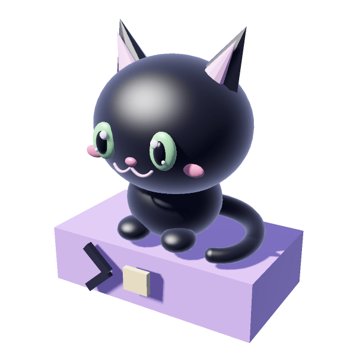
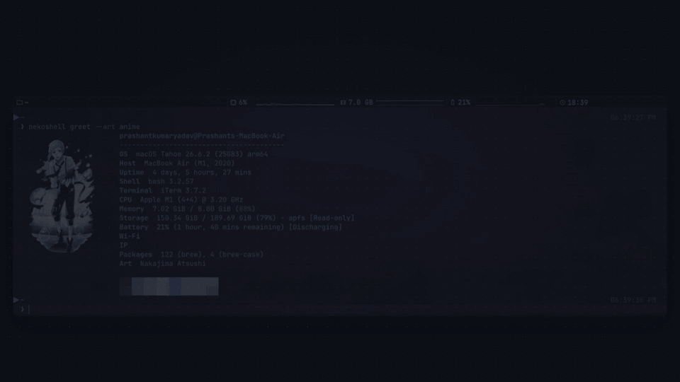

<p align="center">
  <a href="docs/assets/neko.stl"></a>
</p>

<h1 align="center">nekoshell</h1>

<p align="center">
  <a href="https://github.com/0PrashantYadav0/nekoshell/releases/latest"></a>
  <a href="https://github.com/0PrashantYadav0/nekoshell/actions/workflows/ci.yml"></a>
  <a href="https://github.com/0PrashantYadav0/nekoshell/stargazers"></a>
  <a href="https://github.com/0PrashantYadav0/nekoshell/releases"></a>
  <a href="https://github.com/0PrashantYadav0/homebrew-nekoshell"></a>
  <a href="LICENSE"></a>
  
</p>

<p align="center">A Catppuccin terminal rig for macOS: one zsh config, one prompt, a greeting with a Pokémon (or an anime picture, a Minecraft block, an ANSI pattern) or your own pixel art, a music panel, and the same font and colours in iTerm2, kitty, Ghostty, Warp and Terminal.app. One command, <code>nekoshell</code>, installs it, themes it and checks it.</p>

## Demo

Thirty seconds of nekoshell: the greeting, a flavour switch from mocha to latte, the plugins, and the one-line install.

<!-- A GIF, not a <video>: GitHub strips video tags and only plays files uploaded through its own UI, so this is the one form that plays inline on the repository page. -->
[](docs/demo.mp4)

The GIF is silent; the [full-quality video](docs/demo.mp4) is behind it.

Stills of the greeting with the [minecraft](docs/plugins/minecraft.md) and [colorscripts](docs/plugins/colorscripts.md) providers are on those plugin pages, and [docs/TERMINALS.md](docs/TERMINALS.md) shows nekoshell in each of the five terminals.

## Install

You need macOS, Homebrew, zsh and git. Then one of three ways.

From the Homebrew tap, which is the recommended one:

```bash
brew tap 0PrashantYadav0/nekoshell
brew install nekoshell
nekoshell install
```

From one line, which clones `~/.nekoshell` and runs the installer:

```bash
curl -fsSL https://raw.githubusercontent.com/0PrashantYadav0/nekoshell/main/bootstrap.sh | bash
```

From a checkout, which is what contributors use, since the checkout is the install:

```bash
git clone https://github.com/0PrashantYadav0/nekoshell.git ~/.nekoshell
cd ~/.nekoshell
./install.sh
```

The installer asks which terminal and which profile, backs up every file it replaces, and can be re-run safely. [docs/INSTALL.md](docs/INSTALL.md) has the seven steps it runs, the profiles, the flags for a run that should not ask, the steps only you can do afterwards, and the troubleshooting.

## Commands

| Command | What it does |
| --- | --- |
| `nekoshell install` | link the zshrc, pick a terminal and profile, apply the theme, enable plugins |
| `nekoshell doctor [--json]` | one line per check; exit 1 only when a check fails |
| `nekoshell theme list\|current\|auto\|FLAVOUR` | switch or inspect the colour theme |
| `nekoshell terminal list\|use\|remove\|apply\|background` | detect, configure and theme the terminals you use |
| `nekoshell plugin list\|info\|add\|remove` | manage plugins |
| `nekoshell music [PLAYER] [--panel]` | run the music player here, or in the terminal's panel |
| `nekoshell greet [--image\|--text\|--art NAME]` | print the greeting now (greet plugin) |
| `nekoshell art list\|add\|sample` | manage the greeting's art pack (greet plugin) |
| `nekoshell spotify search\|client-id\|login\|logout` | search and play, and your Spotify login (spotify plugin) |
| `nekoshell vscode terminal [ID]` | the terminal VS Code opens (vscode plugin) |
| `nekoshell ai welcome\|edit\|status` | the banner in front of AI coding tools (ai plugin) |
| `nekoshell uninstall [--yes] [--purge]` | remove plugins, unlink the zshrc, restore your files |

`nekoshell help` lists them all, with every flag and the commands enabled plugins add; [docs/INSTALL.md](docs/INSTALL.md#commands) has the same list with what each subcommand takes.

## Plugins

The core is the zsh config, the Starship prompt, the theme and the five terminal adapters; everything past that is a plugin, and a profile is a list of them. The `minimal` profile enables modern-cli, greet and pokemon; `dev` adds fzf, atuin, lazygit, btop, nvim and tmux; `full` adds spotify; `pick` lets you toggle them one by one. The other fourteen are one `nekoshell plugin add` away: the art providers anime, minecraft and colorscripts, then yazi, gh, mise, pure, p10k, omz, ai, claude-code, opencode, vscode and aerospace. [docs/plugins/README.md](docs/plugins/README.md) is the manual, one page per plugin.

## Docs

- [docs/README.md](docs/README.md): the index, every page grouped by what you came for.
- [docs/INSTALL.md](docs/INSTALL.md): installing, the commands, upgrading, uninstalling, troubleshooting.
- [docs/CONFIGURATION.md](docs/CONFIGURATION.md): `nekoshell.toml`, the themes, the prompt, `greet.conf`, your own `local.zsh`.
- [docs/TERMINALS.md](docs/TERMINALS.md): what the five terminals can do and what each still needs by hand.
- [docs/ARCHITECTURE.md](docs/ARCHITECTURE.md): how the pieces fit.
- [docs/plugins/README.md](docs/plugins/README.md): one page per plugin, and [how a plugin works](docs/plugins/ARCHITECTURE.md) behind them.
- [Contributing](https://github.com/0PrashantYadav0/nekoshell/blob/main/CONTRIBUTING.md) and the [contributor guides](https://github.com/0PrashantYadav0/nekoshell/blob/main/docs/contributing/README.md): the checks, writing a plugin, an adapter or a test.
- [AGENTS.md](https://github.com/0PrashantYadav0/nekoshell/blob/main/AGENTS.md) and [docs/ai/](https://github.com/0PrashantYadav0/nekoshell/blob/main/docs/ai/README.md): installing nekoshell through an AI agent, and the agent-facing plugins.

## Contributing

Issues and pull requests are welcome; [CONTRIBUTING.md](https://github.com/0PrashantYadav0/nekoshell/blob/main/CONTRIBUTING.md) has the setup, `make check` and the commit message rules. [CHANGELOG.md](CHANGELOG.md) lists what changed, and [THIRD_PARTY.md](THIRD_PARTY.md) every vendored file and everything an install fetches.

## License

MIT, see [LICENSE](LICENSE). The sprites and pictures the greeting draws come from packs fetched at install time and are not part of this repository; only the screenshots show them. The neko mascot is the project's own model, MIT like the rest. Pokémon is a trademark of The Pokémon Company and Minecraft of Mojang.
